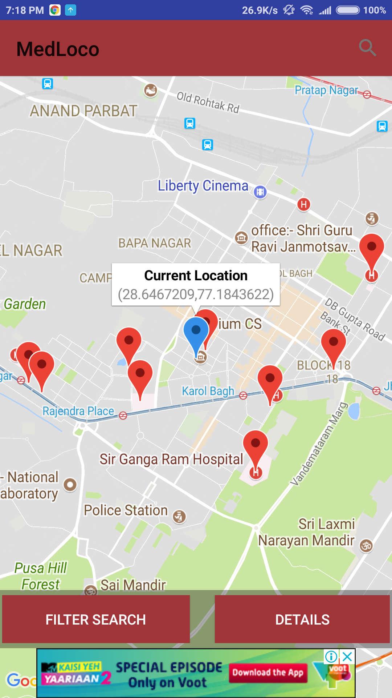
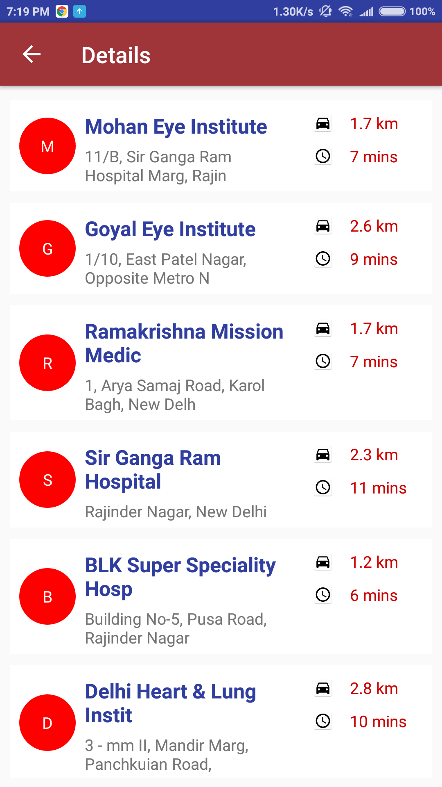
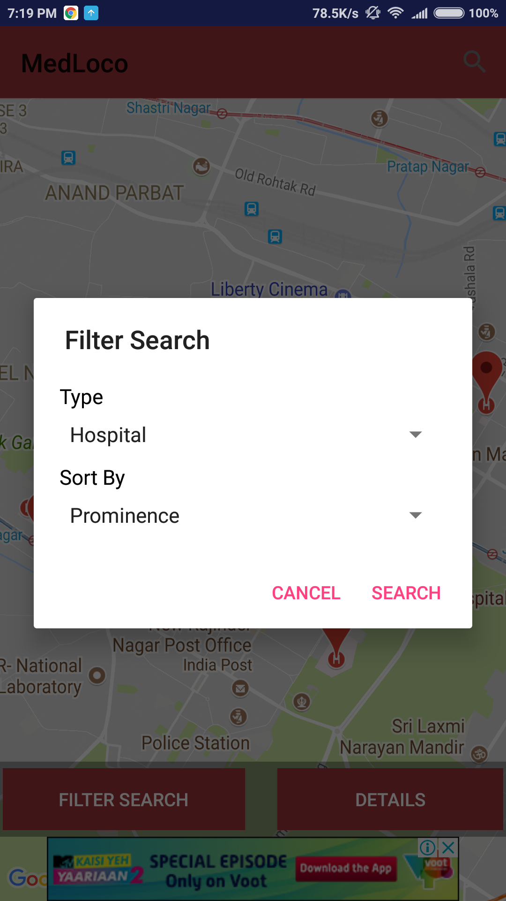
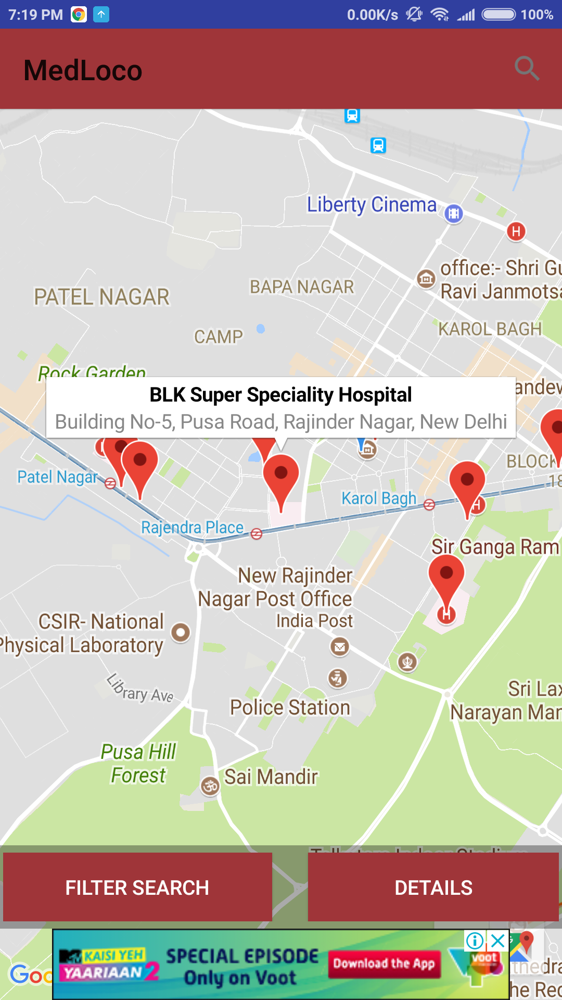

<h2>MedLoco</h2>

<b> Google Play Store </b> - https://play.google.com/store/apps/details?id=com.mayank7319gmail.hospitallocator

MedLoco is a convenient app which helps you to locate any hospitals or doctors in your vicinity in case of a medical emergency.
It uses your device GPS to accurately find your location and show you relevant hospitals near you.

MedLoco works in all parts of the world. This application requires a working internet connection and access to GPS.

<b>Features</b>:

- Find the hospitals near you irrespective of your location
- Filter your search using a variety of parameters
- Search for Hospitals, Doctors or Dentists
- Provides access to details like ratings, website and pictures of the location
- One tap access to call and navigation to the hospital

<b>Screenshots</b>  

 

